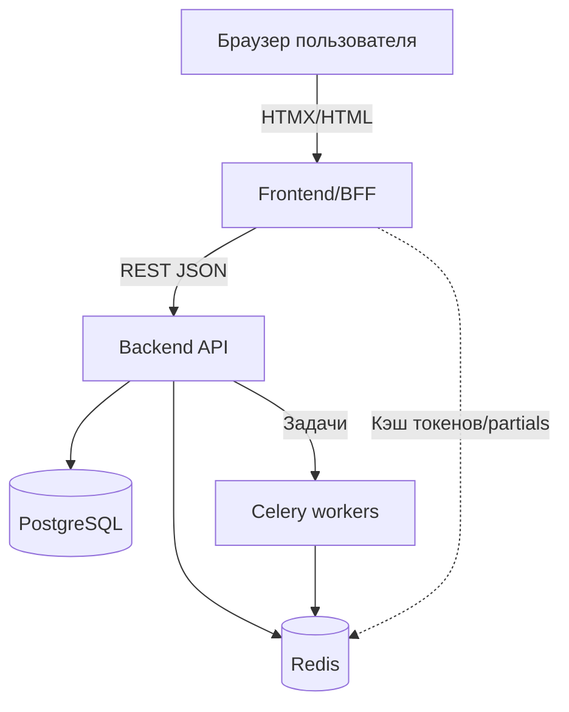

# CRM BFF Portfolio Project

Пет-проект CRM-системы с архитектурой Back-for-Front (BFF). Репозиторий предназначен для демонстрации подхода, поэтому делает упор на документацию, читаемый код и понятные сценарии запуска.

## Стек

- Backend: Django + DRF + PostgreSQL + Celery + Redis.
- Frontend/BFF: Django Templates + HTMX + Tailwind + Redis cache.
- Инфраструктура: Docker Compose, Gunicorn, Nginx.
- Инструменты качества: pytest, pre-commit, Sentry/structured logging (по желанию).

## Роли и зоны ответственности

| Роль / участник         | Зона ответственности                                                                                   | Артефакты/директории                                                    |
|-------------------------|--------------------------------------------------------------------------------------------------------|-------------------------------------------------------------------------|
| Тимлид (Codex)          | Архитектурное видение, планирование, методички, ревью решений.                                         | plan.md, README.md, docs/                                         |
| Backend-разработчик     | Реализация ackend/: модели, DRF API, Celery, миграции, интеграция с Postgres/Redis.                 | ackend/ (Dockerfile, Makefile, .env.example, requirements)         |
| Frontend/BFF-разработчик| Django templates, HTMX, Tailwind, BFF-сервисы, интеграция с backend API через DTO/клиент.             | rontend/ (services, Dockerfile, Makefile, .env.example)            |
| DevOps/Infra            | Docker/Nginx, CI/CD, переменные окружения, мониторинг/alerting.                                        | docker-compose*.yml, .env*, infra/                                |

Таблица помогает быстро понять, к кому относится конкретный раздел и кому адресовать вопросы.
## Структура (в разработке)

```text
drf_project/
├─ backend/
│  ├─ Dockerfile
│  ├─ Makefile
│  ├─ requirements.txt
│  └─ .env.example
├─ frontend/
│  ├─ services/
│  │  ├─ dto.py
│  │  └─ backend_api.py
│  ├─ Dockerfile
│  ├─ Makefile
│  ├─ requirements.txt
│  └─ .env.example
├─ docs/
├─ infra/
├─ docker-compose.yml
├─ docker-compose.prod.yml
├─ Makefile
├─ plan.md
└─ README.md
```

### Ожидаемая структура после реализации

```text
drf_project/
├─ docs/
│  ├─ bff-integration.md
│  ├─ tech-cheatsheet.md
│  ├─ infra-dev.md
│  ├─ infra-prod.md
│  └─ sprints/
│      ├─ sprint1.md
│      ├─ sprint2.md
│      └─ sprint3.md
├─ backend/
│  ├─ config/
│  ├─ apps/
│  │   ├─ users/
│  │   ├─ clients/
│  │   ├─ deals/
│  │   ├─ tasks/
│  │   └─ activity/
│  ├─ requirements/
│  ├─ manage.py
│  └─ Dockerfile
├─ frontend/
│  ├─ config/
│  ├─ services/
│  │   ├─ dto.py
│  │   └─ backend_api.py
│  ├─ templates/
│  ├─ static/
│  ├─ apps/
│  │   ├─ dashboard/
│  │   ├─ clients/
│  │   ├─ deals/
│  │   └─ tasks/
│  ├─ package.json
│  ├─ tailwind.config.js
│  └─ Dockerfile
├─ infra/
│  └─ nginx/default.conf
├─ docker-compose.yml
├─ docker-compose.prod.yml
├─ Makefile
├─ plan.md
└─ README.md
```

## Диаграмма сервисов



## Быстрый старт (dev-режим)

1. Установите зависимости (Python 3.12+, Docker, Make/NPM при необходимости).
2. Скопируйте переменные окружения:
   `powershell
   Copy-Item .env.example .env
   Copy-Item backend\.env.example backend\.env
   Copy-Item frontend\.env.example frontend\.env
   `
3. Запустите инфраструктуру:
   `ash
   docker compose up --build
   `
4. Создайте суперпользователя в backend и администратора в frontend:
   `ash
   docker compose run --rm backend python manage.py createsuperuser
   docker compose run --rm frontend python manage.py createsuperuser
   `
5. Откройте http://localhost:8000 (frontend через nginx) и http://localhost:8000/api/ (backend).
## Частые команды

| Цель                      | Команда                                                                 |
|---------------------------|-------------------------------------------------------------------------|
| Применить миграции        | `docker compose run --rm backend python manage.py migrate`             |
| Выполнить тесты backend   | `docker compose run --rm backend pytest`                               |
| Выполнить тесты frontend  | `docker compose run --rm frontend pytest`                              |
| Собрать Tailwind          | `docker compose run --rm frontend npm run build:css`                   |
| Запустить celery worker   | `docker compose up celery celery-beat`                                 |
| Очистить BFF-кэш          | `docker compose run --rm frontend python manage.py bff_refresh_cache`  |

## Документация

- Архитектура и план: [`plan.md`](plan.md)
- Интеграция BFF ↔ backend: [`docs/bff-integration.md`](docs/bff-integration.md)
- Шпаргалка по стеку: [`docs/tech-cheatsheet.md`](docs/tech-cheatsheet.md)
- Спринт-планы:
  - [`docs/sprints/sprint1.md`](docs/sprints/sprint1.md)
  - [`docs/sprints/sprint2.md`](docs/sprints/sprint2.md)
  - [`docs/sprints/sprint3.md`](docs/sprints/sprint3.md)
- Инфраструктура:
  - Dev окружение — [`docs/infra-dev.md`](docs/infra-dev.md)
  - Prod окружение — [`docs/infra-prod.md`](docs/infra-prod.md)
  - Общий обзор — [`infra/README.md`](infra/README.md)

## Дальнейшие шаги

- Реализовать Django-проекты `crm_backend` и `crm_frontend`.
- Добавить CI (GitHub Actions) и линтеры (`ruff`, `black`, `isort`).
- Подключить централизованный мониторинг (Sentry, Prometheus).

README обновляйте по мере развития репозитория, добавляя команды, скрипты и подсказки.
